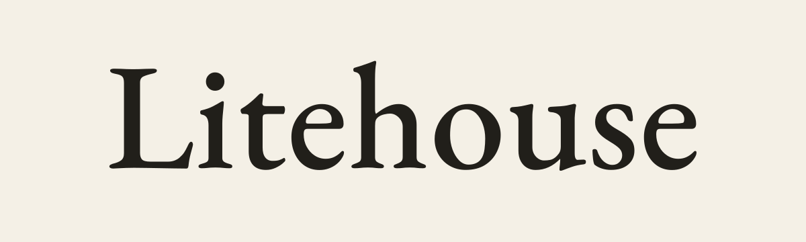

# Litehouse

<p align="center">
  <picture>
    <source media="(prefers-color-scheme: dark)" srcset="assets/brand/png/litehouse-wordmark-dark.png">
    
  </picture>
</p>

Litehouse is a browser-local literature discovery and evidence-reporting workspace for
researchers across the humanities, arts, social sciences, natural and life sciences,
engineering, medicine, law, and interdisciplinary fields.

**Web alpha:** important findings must still be checked in the original works. Litehouse
supports literature review; it does not certify that a study or generated conclusion is
scientifically true.

## Open the app

Use [tunabirgun.github.io/litehouse](https://tunabirgun.github.io/litehouse/). The hosted
site is a static application: there is no Litehouse account, proxy, analytics service,
or application backend.

## What the web alpha does

- Captures a one-time review or reusable watch definition through a guided brief,
  including date range, language, access policy, discipline, work type, expertise,
  prior knowledge, ranking intent, depth, and citation style.
- Queries fixed official endpoints for OpenAlex, Crossref, DataCite, Europe PMC,
  Semantic Scholar, and the Library of Congress directly from the browser. A source
  blocked by CORS or unavailable during a run is recorded as a failure, not silently
  treated as an empty result.
- Reconciles duplicate identifiers and metadata while retaining provenance and
  response hashes.
- Produces an evidence-bounded Markdown report. Every accepted source receives a
  stable report identifier, generated synthesis is rejected if it invents references
  or leaves factual paragraphs uncited, and a deterministic evidence listing is used
  when validation fails.
- Stores reports and watch definitions in this browser profile using IndexedDB and
  verifies report Markdown against its SHA-256 receipt when it is saved and opened.
- Exports report Markdown and its JSON integrity manifest without uploading them.
- Runs a pinned open-source Qwen3 model in a Web Worker through WebGPU. Litehouse
  recommends conservative 0.6B, 1.7B, or 4B tiers from detected browser capabilities,
  shows real download progress, and supports cancel, retry, and cache removal.
- Can connect to a user-controlled OpenAI-compatible gateway or, after an explicit
  client-key warning, directly to OpenAI, Anthropic, or Gemini. Provider credentials
  remain in memory for the current tab and are never written to browser storage.
- Supports light, dark, and system themes, reduced motion, keyboard navigation,
  responsive layouts, and English and Turkish interfaces.

## Privacy and security boundaries

The page and application shell come from GitHub Pages. Research queries go directly
from the browser to each selected literature source. Model files go directly to the
pinned model hosts. If a remote AI provider is enabled, the evidence and prompt go
directly to that provider under its terms. Litehouse has no server in any of those
paths.

An API key entered into any browser page cannot be a server-grade secret: extensions,
malicious dependencies, or a compromised origin could read it while it is in use.
Browser-local WebGPU is therefore the default. A local gateway must explicitly permit
the site's browser origin, and the browser's HTTPS, CORS, and private-network rules
still apply.

The deployment uses a restrictive content-security policy, a no-referrer policy,
pinned GitHub Actions, a SHA-256 artifact manifest, bounded network responses, and a
service worker that caches only same-origin application assets. Literature responses,
PDFs, API requests, prompts, reports, and model caches are not placed in the Litehouse
offline-shell cache.

Browser storage is not an encrypted vault and can be cleared by the user, browser, or
operating system. Export important reports and keep sensitive research on a trusted
device profile. See the in-app Privacy page for the complete data-flow explanation.

## Static-web limitations

- A watch runs once when it is created and saves its definition for reuse. This alpha
  does not execute scheduled or catch-up runs; start each future update manually while
  Litehouse is open. A static site cannot promise closed-browser execution or email delivery.
- Literature services decide whether their APIs accept direct browser requests. A
  rejected source remains visible in the report receipt.
- Source APIs do not expose every brief field consistently. This alpha does not yet
  enforce publication interval, language, discipline, work-type, or exclusion filters
  consistently across every source; use the retrieval receipt and original works when
  checking coverage.
- Full PDF annotation, native reference-manager handoff, and compiled LaTeX/PDF output
  are not part of this web alpha yet. The current verified report artifacts are Markdown
  and JSON.
- GitHub Pages does not let this repository set arbitrary HTTP response headers, so the
  app cannot promise cross-origin isolation. The local-model panel checks actual WebGPU
  support before enabling a download.

## Run locally

Use an exact lockfile install and start the Vite development server:

```sh
npm ci --ignore-scripts
npm run dev
```

Then open `http://127.0.0.1:4173/`.

Run the public web verification gates with:

```sh
npm run typecheck
npm run build
npm audit --omit=dev
```

The production build is written to `web/dist`. GitHub Actions deploys that directory
to Pages and publishes `SOURCE_COMMIT` plus `SHA256SUMS.txt` alongside it.

## License

Litehouse is released under the [Apache License 2.0](LICENSE). Fonts and model artifacts
retain their respective licenses and pinned provenance records.
